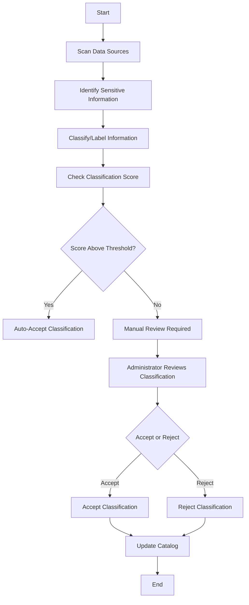

We can use this page to save content that we might want to use in the future.
---
The flow includes scanning the data sources and classifying the data. The classifications are auto-accepted based on the
score. If the score is below the threshold, the classifications are identified for manual review. Administrators can
accept or reject the classifications.

This diagram represents the flow of Privacera Discovery from scanning data sources to updating the catalog based on
classification reviews.
---

---
Privacera Discovery employs a variety of techniques to identify and classify sensitive information:

- **Pattern Matching with Regular Expressions**: Utilizes regular expressions to detect patterns associated with sensitive data.
- **Dictionaries**: Uses whitelists or blacklists to look up data.
- **Heuristics**: Analyzes data content and context, such as table or column names, to identify sensitive information.

---
