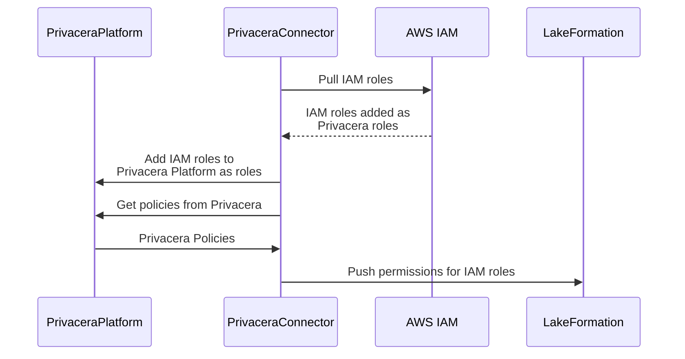
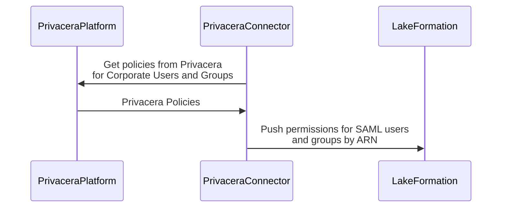

# AWS Lake Formation - Push Mode - Access Management

!!! info "Connector configuration modes"
    This document describes the configuration modes for the AWS Lake Formation connector with Privacera using the 
    Push mode. If your are looking information about Pull mode, then refer to 
    [AWS Lake Formation - Pull mode](../../index.md#pull-mode). For differences between the Push and 
    Pull modes, [refer to](../../index.md).

## Introduction

In this mode, Privacera is the source of truth for access control policies. For more information on the Push mode, refer 
to [Push mode](../../index.md#push-mode).

## Access Management

| Topic                                                                          | Detail                                                                                                      |
|--------------------------------------------------------------------------------|-------------------------------------------------------------------------------------------------------------|
| Integration methodology                                                        | [Privacera PolicySync](../../../../resources/design/access-management/integrations/privacera_policysync.md) |
| [Access Tools](../../../../resources/design/access-management/access_tools.md) | AWS Console, JDBC                                                                                           |
| Supported [User Identities](../../../../resources/design/access-management/user_identities.md)                                | AWS IAM, SAML                                                                                               |

!!! note "Supported User Identities"
    All user identities are not supported in all AWS services and connections. Refer to AWS documentation
    for the capabilities of accessing AWS services like AWS Athena and AWS Redshift using AWS Console and JDBC

### Supported Access Management Features

| Feature                                        | Supported | Native | Using SecureView |
|------------------------------------------------|-----------|--------|------------------|
| :green_circle: Database Access Control         | Yes       | Yes    | N/A |
| :green_circle: Table Access Control            | Yes       | Yes    | N/A |
| :green_circle: View Access Control             | Yes       | Yes    | N/A |
| :green_circle: Column Access Control           | Yes       | Yes    | N/A |
| :green_circle: Row Access Control              | Yes       | Yes    | N/A |
| :no_entry_sign: Cell Access Control            | No        | No     | N/A |
| :no_entry_sign: Dynamic Column Data Masking    | No        | No     | N/A |
| :no_entry_sign: Dynamic Column Data Encryption | No        | No     | N/A |
| :green_circle: Centralized Access Audit        | Yes       | N/A    | N/A |
| :no_entry_sign: Granular Access Audit Record   | No        | N/A    | N/A |

### :warning:Limitations for Access Management Features

1. Lake Formation doesn't support external UDF, so column masking and encryption from Privacera are not available.
2. Privacera doesn't support Cell Level Filtering for Lake Formation.

### User Identity Mapping

Lake Formation supported services like AWS Athena and AWS Redshift Spectrum use AWS IAM and SAML users for access
control. The roles in Privacera are mapped to the IAM roles in AWS. Any permissions granted to the roles in Privacera
are pushed to Lake Formation for the corresponding IAM roles. For SAML users and groups, the permissions for users and
groups in Privacera are pushed to Lake Formation with the SAML ARN prefix.

This connector pulls the IAM roles from AWS IAM and adds them to Privacera as roles. Any policies defined in Privacera
for these roles are pushed to Lake Formation for the corresponding IAM roles.

##### AWS IAM Roles and Lake Formation

!!! info "Users for Roles"
    For the roles are created in Privacera, the users for the roles need to be explicitly added to the roles.
    ==[TODO: Give link here]==

##### SAML Users and Groups in Lake Formation

## Discovery Features

Discover features are not supported in Lake Formation connectors

## Data Encryption Features

Data encryption features are not supported in Lake Formation connectors

-   :material-page-previous: Prev topic: [About Lake Formation](../index.md)
-   :material-page-next: Next topic: [Prerequisites](prerequisites.md)

