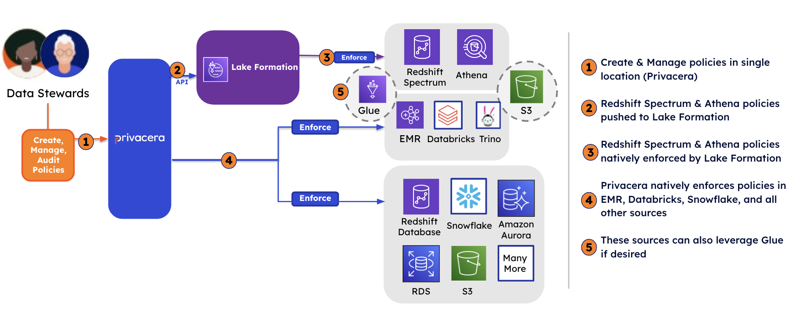
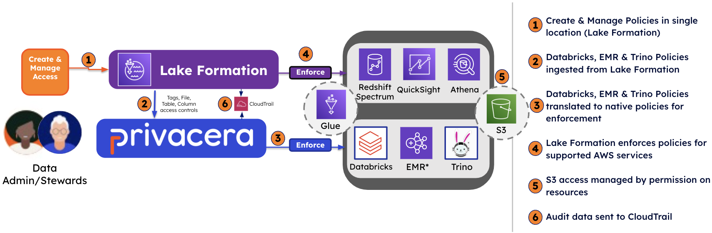

# AWS Lake Formation

AWS Lake Formation is a fully managed service that makes it easy to build,
secure, and manage data lakes. AWS Lake Formation provides its own permissions
model that augments the IAM permissions model. This centrally defined
permissions model enables fine-grained access to data stored in data lakes
through a simple grant or revoke mechanism, much like a relational database
management system (RDBMS). AWS Lake Formation permissions are enforced using
granular controls at the column, row, and cell-levels across AWS services,
including Amazon Athena, Amazon EMR, and Amazon Redshift.

## Connector configuration modes

Following two modes are available for configuring the AWS Lake Formation
connector with Privacera.

### Push mode

In this mode, Privacera is the source of truth for access control policies.
The access control policies are defined in the Privacera and then these
policies will be pushed to AWS Lake Formation. From there, these policies will
be enforced for the AWS Lake Formation-supported services, such as Amazon
Redshift Spectrum, Amazon EMR, and Amazon Athena. 

As shown in the above image, with the Push mode, all the policies are
stored and managed by Privacera. For the databases that are in Amazon S3 and
managed by AWS Glue Catalog, Privacera will push the policies to AWS Lake
Formation using Lake Formation APIs. AWS Lake Formation will enforce these
policies natively. Privacera uses its connector architecture to enforce the
remaining data sources.

Since the same databases and tables defined in AWS Glue could be used by other third party tools–such as Databricks and
Trino–it the same policies can be optionally enforced by these tools also. Please note, in this case the capabilities
will be limited to the capabilities Privacera supports in Lake Formation.

### Pull mode

In this mode, the AWS Lake Formation is the source of truth for access
control. The access control policies are pulled from the Lake Formation at
specific time intervals. From Privacera, and then these policies get enforced
on various data sources defined by the configuration provided. 

As shown in the above image, with the Pull mode, AWS Lake Formation is the
primary store for the dataset in S3 that is managed by Glue Catalog. Since AWS
Lake Formation is the primary store, administrators will manage these policies
directly in the AWS Lake Formation console or through its APIs. Since the same
databases and tables defined in AWS Glue could be used by other third party
tools–such as Databricks and Trino–it is paramount that the same policies are
consistently enforced by these tools also.

Privacera has native integrations with most of the other tools that use AWS
Glue and it can assist in enforcing these policies. This is implemented by
pulling the policies and tags from AWS Lake Formation and pushing them to
Privacera. Once the policies and tags are in Privacera, then Privacera will
enforce them in Databricks and/or Trino by applying the same original policies
defined in AWS Lake Formation.
