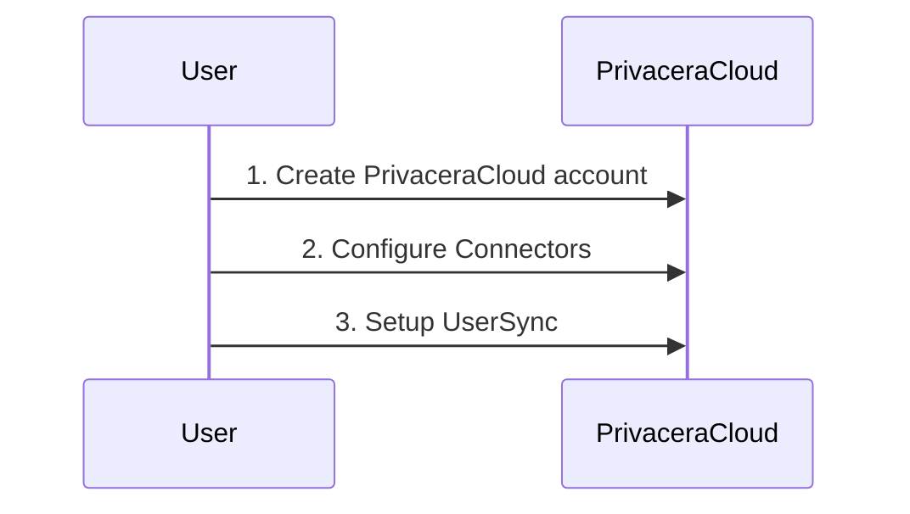
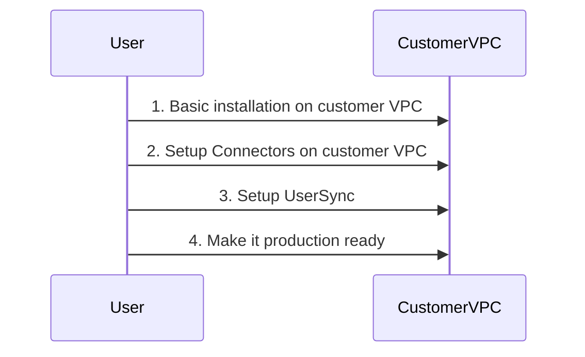
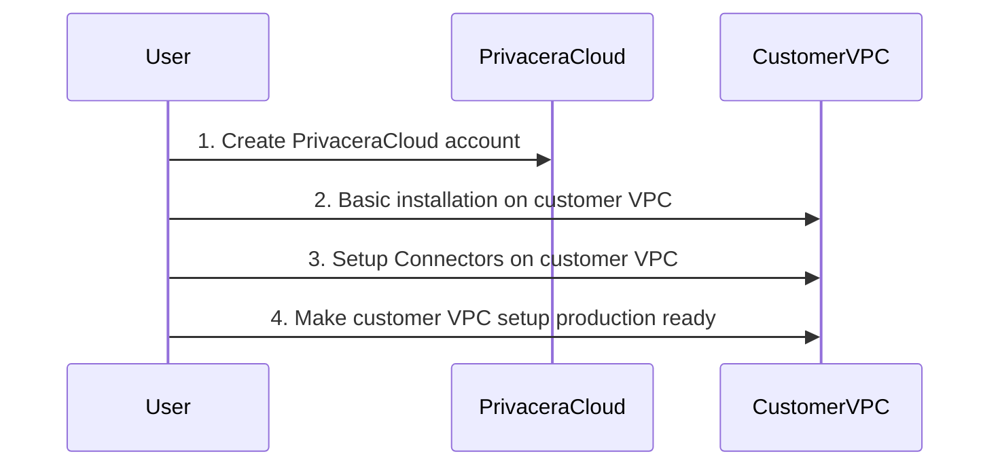

## Deployment Options

Privacera offers three deployment options to suit different organizational needs and preferences:
PrivaceraCloud, Self-Managed and PrivaceraCloud Data-plane.

### 1. PrivaceraCloud

### PrivaceraCloud Description

--8<-- "docs/get-started/deployment-options/snippets/privacera-cloud-description.md"

**Key Features:**

- **Managed Service:** Privacera handles all infrastructure, maintenance, and updates, ensuring high availability and
  reliability.
- **Flexible Integration:** Organizations can choose to deploy connectors and the Discovery module within their own
  Virtual Private Cloud (VPC), allowing sensitive data to remain within their control while leveraging Privacera’s
  managed services.
- **Compliance and Security:** Benefit from Privacera's robust security practices and compliance certifications,
  ensuring your data governance needs are met with the highest standards.

### 2. Self-Managed

The Self-Managed deployment option allows organizations to run the entire Privacera platform within their own Virtual
Private Cloud (VPC). This approach provides complete control over the deployment, configuration, and management of
Privacera, offering maximum flexibility and customization.

**Key Features:**

- **Full Control:** Organizations maintain full control over their infrastructure, data, and governance policies,
  allowing for customized configurations and optimizations.
- **Cloud:** Deploy Privacera within any cloud provider's VPC, aligning with your existing infrastructure and IT
  strategies.
- **Data Security:** All components, including control plane, connectors and the Discovery module, operate within the
  organization's
  VPC, ensuring sensitive data never leaves their controlled environment.
- **Customization:** Tailor the deployment to meet specific security, compliance, and operational requirements unique to
  your organization.

    
    
### 3. PrivaceraCloud Data-plane

The Data-plane deployment option gives you best of both the deployment options listed above. You get to use the
PrivaceraCloud to manage the data governance and security policies, and audit-store, and some components that 
access your data-sources are deployed in your cloud provider VPC, thereby ensuring that your data never leaves 
your cloud provider VPC.

**Key Features:**

- **Compliance and Security:** None of your data leaves your cloud provider VPC.
- **Credentials for Data-Sources:** All the credentials for the data-sources are stored within your cloud provider VPC.
- **Managed Service**: PrivaceraCloud provides the infrastructure, maintenance and update, high availability and
  reliability for managing your data governance and security policies as well as audit information.

## Deployment Options Comparison

By offering the above PrivaceraCloud, Self-Managed and Data-plane deployment options, Privacera provides the flexibility
to choose the best approach for your organization's data governance and security needs, whether you prefer a fully
managed service, complete control over your deployment or a hybrid approach.

To help you choose the correct deployment option for your organization, the table below outlines the key differences
between PrivaceraCloud and Self-Managed deployments:

| Feature                         | PrivaceraCloud (SaaS)                                                  | Self-Managed                                     | PrivaceraCloud Data-plane                                                                                                           |
|---------------------------------|------------------------------------------------------------------------|--------------------------------------------------|-------------------------------------------------------------------------------------------------------------------------------------|
| **Deployment Location**         | Hosted by Privacera                                                    | Customer's VPC                                   | Management interface and Audit store are hosted by Privacera. Components accessing your data are hosted in your cloud provider VPC. |
| **Management Responsibility**   | Managed by Privacera                                                   | Managed by Customer                              | Data-plane components managed by Customer                                                                                           |                                                                                                                             |
| **Scalability**                 | Easily scalable; managed by Privacera                                  | Customer-managed scaling                         | Data-plane components scaled by Customer                                                                                            |
| **Infrastructure Maintenance**  | Handled by Privacera                                                   | Customer responsibility                          | Infrastructure for Data-plane components is Customer responsibility                                                                 |
| **Connector Deployment**        | Option to deploy in customer's VPC                                     | Deployed in customer's VPC                       | Deployed in Customer's VPC                                                                                                          |
| **Discovery Module Deployment** | Deployed in customer's VPC                                             | Deployed in customer's VPC                       | Deployed in Customer's VPC                                                                                                          |
| **Control Over Environment**    | Limited to configuration and policies                                  | Full control over infrastructure and environment | Full control over the Data-plane components                                                                                         |
| **Compliance and Security**     | Managed compliance and security standards by Privacera                 | Customer-managed compliance and security         | Customer-managed compliance and security of Data-plane components                                                                   |
| **Updates and Patches**         | Automatically managed by Privacera                                     | Customer responsible for updates and patches     | Customer responsible for updates and patches of Data-plane components                                                               |
| **Operational Overhead**        | Minimal for the customer                                               | Higher, as managed by the customer               | Medium, only limited to data-plane components                                                                                       |
| **Data Residency**              | Data can remain in customer's VPC with connectors and Discovery module | All data and components reside in customer's VPC | All data and credentials reside in customer's VPC                                                                                   |

By considering these differences, you can select the deployment option that best aligns with your organization's
operational preferences, control requirements, and resource capabilities.

!!! note "Privacera Discovery Deployment"
    Privacera Discovery scales well when deployed as Data Plane on customer VPC. 

-   :material-page-previous: Next: [Base Installation](../base-installation/index.md)

