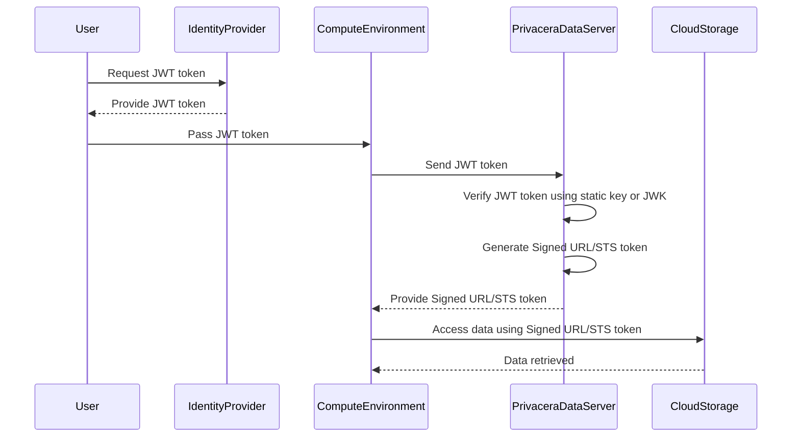

# About JWT Tokens

By default, Privacera supports the native authentication mechanism of the data source. However, in some cases, the
compute environment of the data source might not be able to reliably authenticate the user. In such cases, Privacera
allows alternate authentication mechanisms, such as JWT tokens.

A common use case is when processing data in cloud storage, such as AWS S3, using Apache Spark on EKS, EMR, or
Databricks. In these scenarios, the compute environment may not have the ability to authenticate the user. To address
this, Privacera supports JWT tokens for authentication. The user can generate a JWT token using their Identity
Provider (IdP) and pass it to the compute environment. The compute environment can then use the JWT token to
authenticate the user with Privacera.

Using JWT tokens is primarily supported by Privacera DataServer when generating Signed URLs or STS tokens for accessing
data in cloud storage. The JWT token is passed to Privacera DataServer, which validates the token and generates the
Signed URL or STS token for the user. The user can then use the Signed URL or STS token to access the data in cloud
storage.

**Sample Flow**

**Diagram Explanation**

1. **Request JWT Token**: The user requests a JWT token from the Identity Provider (IdP).
2. **Provide JWT Token**: The IdP provides the JWT token to the user.
3. **Pass JWT Token**: The user passes the JWT token to the compute environment.
4. **Send JWT Token**: The compute environment sends the JWT token to Privacera DataServer.
5. **Verify JWT Token**: Privacera DataServer verifies the JWT token signature by using either IdP public key that is
   statically configured or is obtained dynamically from IdP's JWKS endpoint.
6. **Confirm JWT Validity**: The IdP confirms the JWT token's validity.
7. **Generate Signed URL/STS Token**: Privacera DataServer generates a Signed URL or STS token.
8. **Provide Signed URL/STS Token**: Privacera DataServer provides the Signed URL or STS token to the compute
   environment.
9. **Access Data**: The compute environment accesses data from cloud storage using the Signed URL or STS token.
10. **Data Retrieved**: The data is retrieved from the cloud storage and provided to the compute environment.

## JWT Token Format

[TODO: Add JWT token format details]

## Generate JWT Token

[TODO: Add steps to generate JWT token]

## Use JWT Token

[TODO: Add steps to use JWT token. Give example for Spark on EKS, EMR, or Databricks]
