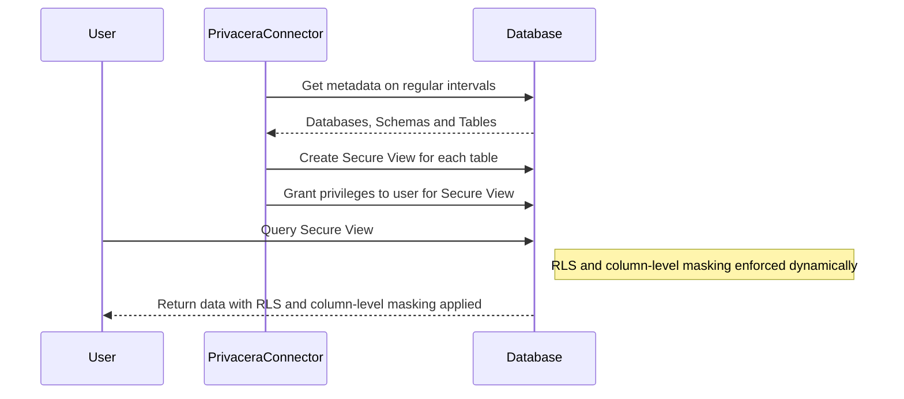

# About Secure Views

For most databases like Snowflake and Redshift DB, native enforcement of row-level security (RLS) and column-level
masking is supported. However, some databases like PostgreSQL and Databricks SQL do not support native enforcement of
RLS and column-level masking. In such cases, Privacera provides a feature called Secure Views to enforce these security
measures.

!!! info "Running queries on dataset"
    When Secure Views are enabled, users are mandated to access data through these views, and Privacera grants access
    to these views. RLS and column-level masking policies are applied to these views, and when a user queries the Secure
    View, these policies are dynamically enforced.

**Key Advantages**

- **Dynamic Enforcement**: Secure Views allow for the enforcement of RLS and column-level masking dynamically without
  modifying the underlying database schema.
- **Layered Security**: Secure Views are created on top of existing tables, and RLS and column-level masking policies
  are applied to the views. When a user queries the Secure View, these policies are dynamically enforced.

**Implementation**

- **Creation of Secure Views**: For each table that requires RLS and column-level masking, Privacera creates a Secure
  View. Users are mandated to access data through these Secure Views, and Privacera grants access accordingly.
- **Naming Convention**: The naming convention for Secure Views is configurable. By default, Privacera creates a new
  database or schema with the same name as the original, appended with a `_secure` suffix, and creates Secure Views
  within this schema. The Secure Views have the same names as the original tables for easy identification.

**Limitations**

1. **Only SELECT Queries Supported**: Secure Views support only SELECT queries.
2. **Query Updates Required**: Users need to update their existing queries to use the new namespace (e.g., database or schema name) or table name.

## Data Admin

Some users may need the ability to update the data in the tables. These users can be granted the Data Admin privilege in
Privacera. The Data Admin privilege allows users to update data in the underlying tables. However, for these users, RLS
and column-level masking policies are not enforced.

!!! info "Consideration for Data Admin users"
    Make sure to give Data Admin privileges only to users who need to update the data in the tables. These users
    will have full access to the underlying tables and will not be subject to RLS and column-level masking policies.

