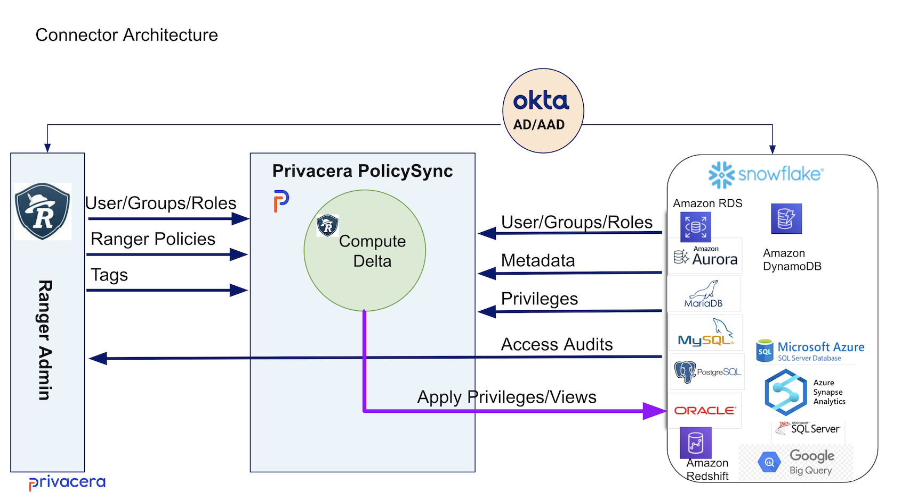
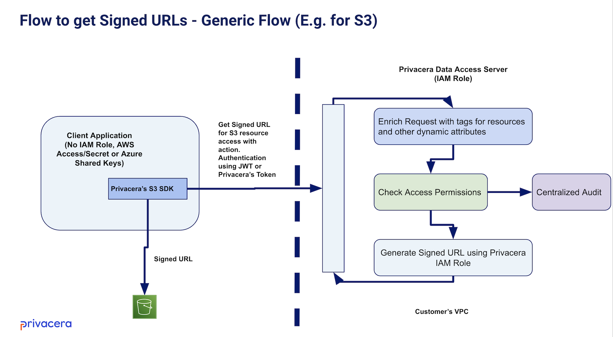

# Access Management Integrations

Privacera offers three primary integration mechanisms to enforce permissions across various data sources efficiently.
These mechanisms ensure that data governance and security policies are seamlessly applied, providing robust protection
and compliance. 

The detailed descriptions of these mechanisms are as follows:

## Apache Ranger Plugin

**Overview**:
The Apache Ranger Plugin is a lightweight Java library embedded within the compute environment of the data source. It
enforces security policies in real-time and provides centralized auditing capabilities.

**Key Features**:

- **Real-Time Policy Enforcement**: The plugins enforce policies as data access requests are made, ensuring immediate
  and up-to-date protection.
- **Embedded Integration**: Being embedded within the data source's compute environment, these plugins offer seamless
  integration and minimal performance overhead.
- **Centralized Auditing**: Audit logs generated by the plugins are sent to a central audit service, enabling
  comprehensive monitoring and compliance reporting.
- **Versatility**: This mechanism is versatile and supports various data sources and platforms, enhancing its
  applicability across different environments.

**How It Is Done**:

- **Plugin Deployment**: Lightweight Java plugins are deployed within the compute environment of the data source.
- **Policy Retrieval**: These plugins retrieve security policies from the Privacera platform or a Ranger admin service.
- **Real-Time Enforcement**: As data access requests are made, the plugins enforce the relevant policies in real-time.
- **Auditing**: The plugins generate audit logs for each access request, which are sent to a central audit service for monitoring and reporting purposes.
- **Dynamic Updates**: Policies can be updated dynamically without downtime, as the plugins continuously check for policy updates.

## Privacera PolicySync

**Overview**:
Privacera PolicySync is designed to manage and enforce policies across different data sources and applications which
have strong native enforcement capabilities. This mechanism involves defining policies within the Privacera platform
and then pushing these policies down to the native systems of the data sources.

**Key Features**:

- **Centralized Policy Management**: Policies are defined once within the Privacera platform and then propagated to
  various data sources, ensuring consistency and reducing administrative overhead.
- **Native Enforcement**: Once policies are pushed to the data source, they are enforced by the data source's native
  system, leveraging its inherent security capabilities.
- **Scalability**: This mechanism is scalable and suitable for large environments with numerous databases, ensuring
  efficient policy management and enforcement across the board.
- **Common Use Cases**: It is commonly used for databases like Snowflake, RedShift DB and applications like AWS Lake
  Formation and Databricks Unity Catalog

**How It Is Done**:

- **Policy Definition**: Administrators define access control policies within the Privacera platform.
- **Policy Distribution**: Privacera PolicySync pushes these policies to the respective data sources.
- **Native System Enforcement**: The data source's native security system enforces the policies. This ensures that access control is managed using the data source’s inherent security mechanisms.
- **Policy Updates**: Any changes to the policies in Privacera are automatically synchronized with the data sources, ensuring up-to-date enforcement.
- **Auditing**: Audit logs are pulled from the data sources and sent to the Privacera platform for centralized monitoring and reporting.

## Privacera DataServer

**Overview**:
Privacera DataServer is tailored for integrations with cloud-based storage solutions like AWS S3, Azure ADLS, and GCP
GCS. It facilitates secure data access through the generation of signed URLs.

**Key Features**:

- **Signed URL Generation**: The DataServer generates signed URLs that provide temporary, secure access to the data,
  ensuring that only authorized users can retrieve or update data.
- **Optimized for Cloud Storage**: This mechanism is optimized for cloud storage services, making it ideal for
  environments where data is stored in cloud-based systems.
- **Compute Integration**: The signed URLs are provided to the compute environments, such as Apache Spark or other
  Java-based applications, enabling secure and efficient data processing.
- **Enhanced Security**: By using signed URLs, this mechanism ensures that data access is tightly controlled and
  monitored, reducing the risk of unauthorized access.

**Common Use Cases**:

- **AWS S3**: Managing access to object storage in Amazon Web Services.
- **Azure ADLS**: Securing data in Azure Data Lake Storage.
- **GCP GCS**: Enforcing policies for data stored in Google Cloud Storage.

**How It Is Done**:

- **Policy Configuration**: Access control policies are defined within the Privacera platform for specific cloud storage services.
- **Request Handling**: When a compute environment (e.g., Apache Spark) needs to access data, it sends a request to the Privacera DataServer.
- **Signed URL Generation**: The DataServer generates a signed URL that grants temporary, secure access to the requested data.
- **Data Access**: The compute environment uses the signed URL to retrieve or update data from the cloud storage service.
- **Security and Expiration**: The signed URL includes security parameters and an expiration time, ensuring controlled and temporary access.
- **Audit Logging**: All access requests and actions are logged for auditing purposes, providing a comprehensive trail of data access activities.

