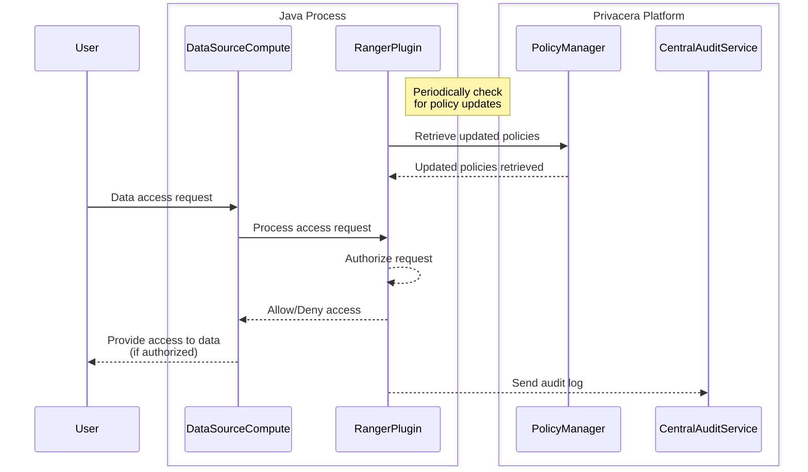

# About Apache Ranger Plugin

The Apache Ranger Plugin is a lightweight Java library embedded within the compute environment of the data source. It
enforces security policies in real-time and provides centralized auditing capabilities.

**Key Features**:

- **Real-Time Policy Enforcement**: The plugins enforce policies as data access requests are made, ensuring immediate
  and up-to-date protection.
- **Embedded Integration**: Being embedded within the data source's compute environment, these plugins offer seamless
  integration and minimal performance overhead.
- **Centralized Auditing**: Audit logs generated by the plugins are sent to a central audit service, enabling
  comprehensive monitoring and compliance reporting.
- **Versatility**: This mechanism is versatile and supports various data sources and platforms, enhancing its
  applicability across different environments.

**How It Is Done**:

- **Plugin Deployment**: Lightweight Java plugins are deployed within the compute environment of the data source.
- **Policy Retrieval**: These plugins retrieve security policies from the Privacera platform or a Ranger admin service.
- **Real-Time Enforcement**: As data access requests are made, the plugins enforce the relevant policies in real-time.
- **Auditing**: The plugins generate audit logs for each access request, which are sent to a central audit service for
  monitoring and reporting purposes.
- **Dynamic Updates**: Policies can be updated dynamically without downtime, as the plugins continuously check for
  policy updates.

-   :material-page-previous: Prev topic: [Integration Types](index.md)
-   :material-page-next: Next topic: [About Privacera PolicySync](privacera_policysync.md)

