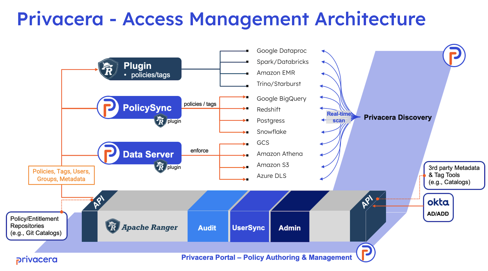

# Access Management Integrations

Privacera offers three primary integration mechanisms to efficiently enforce permissions across various data sources.
The integration mechanisms are chosen based on the native enforcement capabilities of the data source. Refer to each
connector's documentation for detailed information on the integration methodology, supported features, and limitations.

## Integration Mechanisms

### **Apache Ranger Plugin**:

  - **Usage**: Primarily for open-source data sources like Trino, Apache Hive, etc.
  - **Mechanism**: The Apache Ranger Plugin can be embedded within the data source's compute environment.
  - **Features**: Real-time enforcement of security policies and centralized auditing capabilities.
  - **Documentation**: Refer to the [Apache Ranger Plugin](apache_ranger_plugin.md) documentation for more information.

### **Privacera PolicySync**:

  - **Usage**: Designed for managing and enforcing policies across different data sources and applications with strong native enforcement capabilities.
  - **Mechanism**: Policies are defined within the Privacera platform and then pushed down to the native systems of the data sources.
  - **Features**: Centralized policy management and scalable enforcement.
  - **Documentation**: Refer to the [Privacera PolicySync](privacera_policysync.md) documentation for more information.

### **Privacera DataServer**:

  - **Usage**: Tailored for integrations with cloud-based storage solutions like AWS S3, Azure ADLS, and GCP GCS.
  - **Mechanism**: Facilitates secure data access through the generation of signed URLs.
  - **Features**: Secure data access and optimized for cloud storage environments.
  - **Documentation**: Refer to the [Privacera DataServer](privacera_dataserver.md) documentation for more information.

-   :material-page-next: __Go To__

    [About Apache Ranger Plugin](apache_ranger_plugin.md)

    [About Privacera PolicySync](privacera_policysync.md)

    [About Privacera DataServer](privacera_dataserver.md)

