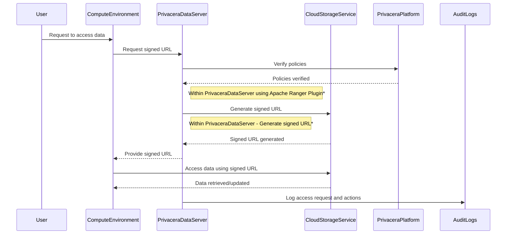

# About Privacera DataServer

Privacera DataServer is tailored for integrations with cloud-based storage solutions like AWS S3, Azure ADLS, and GCP
GCS. It facilitates secure data access through the generation of signed URLs.

**Key Features**:

- **Signed URL Generation**: The DataServer generates signed URLs that provide temporary, secure access to the data,
  ensuring that only authorized users can retrieve or update data.
- **Optimized for Cloud Storage**: This mechanism is optimized for cloud storage services, making it ideal for
  environments where data is stored in cloud-based systems.
- **Compute Integration**: The signed URLs are provided to the compute environments, such as Apache Spark or other
  Java-based applications, enabling secure and efficient data processing.
- **Enhanced Security**: By using signed URLs, this mechanism ensures that data access is tightly controlled and
  monitored, reducing the risk of unauthorized access.

**Common Use Cases**:

- **AWS S3**: Managing access to object storage in Amazon Web Services.
- **Azure ADLS**: Securing data in Azure Data Lake Storage.
- **GCP GCS**: Enforcing policies for data stored in Google Cloud Storage.

**How It Is Done**:

- **Policy Configuration**: Access control policies are defined within the Privacera platform for specific cloud storage
  services.
- **Request Handling**: When a compute environment (e.g., Apache Spark) needs to access data, it sends a request to the
  Privacera DataServer.
- **Signed URL Generation**: The DataServer generates a signed URL that grants temporary, secure access to the requested
  data.
- **Data Access**: The compute environment uses the signed URL to retrieve or update data from the cloud storage
  service.
- **Security and Expiration**: The signed URL includes security parameters and an expiration time, ensuring controlled
  and temporary access.
- **Audit Logging**: All access requests and actions are logged for auditing purposes, providing a comprehensive trail
  of data access activities.

* This API call is made within the Privacera DataServer. No output bound calls are made

-   :material-page-previous: Prev topic: [About Privacera PolicySync](privacera_policysync.md)

