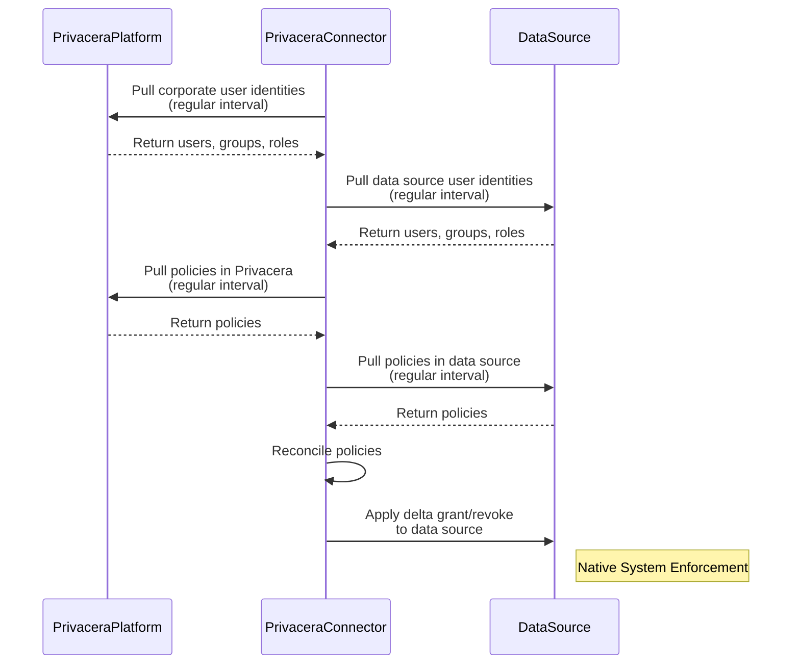
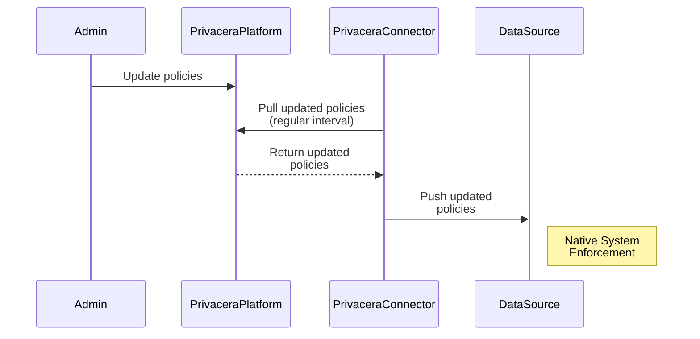
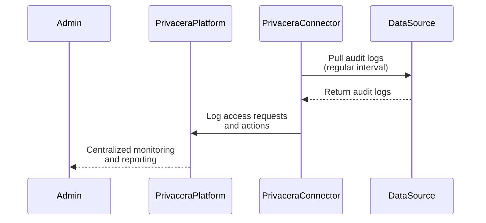

# About Privacera PolicySync

Privacera PolicySync is designed to manage and enforce policies across different data sources and applications which
have strong native enforcement capabilities. This mechanism involves defining policies within the Privacera platform
and then pushing these policies down to the native systems of the data sources.

**Key Features**:

- **Centralized Policy Management**: Policies are defined once within the Privacera platform and then propagated to
  various data sources, ensuring consistency and reducing administrative overhead.
- **Native Enforcement**: Once policies are pushed to the data source, they are enforced by the data source's native
  system, leveraging its inherent security capabilities.
- **Scalability**: This mechanism is scalable and suitable for large environments with numerous databases, ensuring
  efficient policy management and enforcement across the board.
- **Common Use Cases**: It is commonly used for databases like Snowflake, RedShift DB and applications like AWS Lake
  Formation and Databricks Unity Catalog

**How It Is Done**:

There are three primary activities involved in the Privacera PolicySync mechanism:

### **1. Reconciliation Check on Regular Interval**

The reconciliation check ensures that user identities and policies are consistently updated and synchronized between the
Privacera platform, the Privacera Connector, and the data sources.

**Steps**:

- **Pull Corporate User Identities**: The Privacera Connector periodically pulls user identities from the Privacera Platform.
    - **Retrieve Data Source User Identities**: It then retrieves user identities from the data sources.
    - **Pull Policies**: The connector pulls policies from both the Privacera Platform and the data sources.
    - **Reconcile Policies**: The connector reconciles these policies.
    - **Apply Changes**: It applies any necessary changes (grants/revokes) to the data sources.
    - **Native System Enforcement**: Policies are enforced by the data source's native system.

### **2. Admin Updating Policies**

This process involves an administrator updating access control policies within the Privacera platform. The updates are
then synchronized with the data sources to ensure policies are current.

**Steps**:

1. **Admin Updates Policies**: The admin updates policies in the Privacera Platform.
2. **Pull Updated Policies**: The Privacera Connector periodically pulls these updated policies.
3. **Distribute Policies**: The updated policies are then pushed to the data sources.
4. **Native System Enforcement**: The data source’s native system enforces the updated policies.

### **3. Pulling Audits on Regular Interval**

The audit logs are periodically pulled from the data sources and normalize to Apache Ranger audit format and sent to the Privacera Platform, enabling
centralized monitoring and reporting of access activities.

**Steps**:

1. **Pull Audit Logs**: The Privacera Connector periodically pulls audit logs from the data sources.
2. **Log Access Requests and Actions**: Acecss audit logs are normalized to Apache Ranger audit format and sent to the Privacera Platform.
3. **Centralized Monitoring and Reporting**: The Privacera Platform provides centralized monitoring and reporting of these logs for the admin.

-   :material-page-previous: Prev topic: [About Apache Ranger Plugin](apache_ranger_plugin.md)
-   :material-page-next: Next topic: [About Privacera DataServer](privacera_dataserver.md) 

