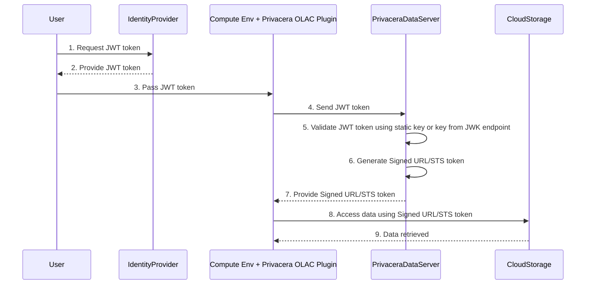
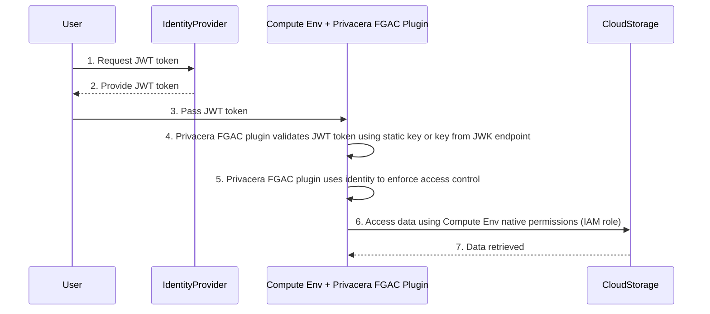

# JWT Token User Identity

## Overview

This feature allows the use of JWT tokens to carry the user identity information required by Privacera to enforce
access control. This works for certain connectors or use-cases where the data source may not be able to pass the user
identity reliably to Privacera.

### Connectors
The following connectors support the use of JWT tokens to carry user identity information:

- OLAC connectors
      - AWS EMR (on EC2) Spark OLAC connector without Kerberos - JWT token user identity is the only supported way to enforce access control in a non-Kerberos EMR (on EC2) cluster.
      - AWS EMR-Serverless Spark OLAC connector without Lake Formation - JWT token user identity allows you to use Privacera for access control in a non-Lake Formation EMR-Serverless cluster without using IAM roles for user identity.
      - Databricks Standard Cluster OLAC connector - JWT token user identity is an additional way to pass user identity to Privacera for access control if you don't want to use the logged-in user identity.
      - Apache Spark on EKS OLAC connector - JWT token user identity is the only supported way to enforce access control  Apache Spark on EKS cluster.
-  FGAC connectors
      - Databricks High Concurrency Cluster FGAC connector - JWT token user identity is an additional way to pass user identity to Privacera for access control if you don't want to use the logged-in user identity.

### Supported Deployments 
- PrivaceraCloud
- Self Managed Deployment
- PrivaceraCloud Data-plane Deployment

### Prerequisites

You need to have a JWT token generation capability in your identity provider (IdP) to generate the JWT token. 
The JWT token is signed by your IdP and contains the user identity information. The user is configured in Privacera with the same username. The public key of the IdP is used to validate the JWT token. It is either configured 
statically in Privacera or provided dynamially through a JWKS endpoint which is configured in Privacera.

For OLAC use-case, you need to have Privacera Dataserver configured and running, to which we will add
the additional configuration to validate JWT token.


### Sample Flow for OLAC



**Diagram Explanation**

1. **Request JWT Token**: The user requests a JWT token from the Identity Provider (IdP).
2. **Provide JWT Token**: The IdP provides the JWT token to the user.
3. **Pass JWT Token**: The user passes the JWT token to the compute environment.
4. **Send JWT Token**: The compute environment sends the JWT token to Privacera DataServer.
5. **Validate JWT Token**: Privacera DataServer validates the JWT token signature by using either IdP public key that is
   statically configured or is obtained dynamically from IdP's JWKS endpoint.
7. **Generate Signed URL/STS Token**: Privacera DataServer generates a Signed URL or STS token.
8. **Provide Signed URL/STS Token**: Privacera DataServer provides the Signed URL or STS token to the compute
   environment.
9. **Access Data**: The compute environment accesses data from cloud storage using the Signed URL or STS token.
10. **Data Retrieved**: The data is retrieved from the cloud storage and provided to the compute environment.

### Sample Flow for FGAC



**Diagram Explanation**

1. **Request JWT Token**: The user requests a JWT token from the Identity Provider (IdP).
2. **Provide JWT Token**: The IdP provides the JWT token to the user.
3. **Pass JWT Token**: The user passes the JWT token to the compute environment.
4. **Validate JWT Token**: Privacera FGAC plugin validates the JWT token signature by using either IdP public key that is
   statically configured or is obtained dynamically from IdP's JWKS endpoint.
5. **Enforce Access Control**: Privacera FGAC plugin uses the user identity to enforce access control.
6. **Access Data**: The compute environment accesses data from cloud storage using the compute environments native permissions (IAM role).
7. **Data Retrieved**: The data is retrieved from the cloud storage and provided to the compute environment.

## Concepts 

### JWT Token Format

A JSON Web Token (JWT) consists of three Base64 strings separated by dots (`.`). These 3 parts are
header, payload and signature. The header and payload are JSON objects, and the signature is a computed over
the header and payload using a secret key. The signature is used to confirm the identity of the issuer
and the integrity of the JWT token. 

The JWT token format is show with an example payload below. All the values are examples and should not be
used as is.

```json
{
  "iss": "https://testidp.example.com/issuer/websec",
  "sub": "infra_test_user",
  "iat": "1721223184",
  "exp": "1721283133",
  "aud": "https://dataserver.example.com"
}
```
The fields in the payload are as follows:

1. The `iss` field is the issuer of the JWT token. This value is configured in Privacera so that it can be used to obtain the configuration for validating the JWT token. This is a mandatory field. Typically, it is in the format of a URL, but it is a literal value and no connection attempt will be made to this URL.
1. The `sub` field is the subject of the JWT token. This is the user identity that Privacera should use to enforce access control. This is a mandatory field. You could configure another key in the payload to be used as the user identity.
1. The `iat` field is the issued at time of the JWT token. This is the time when the token was issued in Unix time. This is a mandatory field. The token is rejected if current time is before this time. 
1. The `exp` field is the expiration time of the JWT token. This is the expiry time of the token in Unix time. This is a mandatory field. The token is rejected if the current time is after this time.
1. The `aud` field is the audience of the JWT token. This is the intended recipient of the token, which is Privacera Dataserver. This is a string that is configured in Privacera and Privacera will use the token only if it matches. This is an optional field.

All other fields in the payload will be ignored by Privacera.

!!! note "Token Duration"
    For OLAC jobs, the token duration can be short as it is used only during the startup of the job to pass the identity to 
    the Privacera Dataserver. For FGAC jobs, the token duration should be long enough to cover the duration of the job.

### JWT Signature Verification

JWT Signature verification is done using the public key of the IdP. The public key can be configured statically in Privacera or dynamically fetched from the IdP's JWKS endpoint.

!!! note "Privacera supports only RSA256 and ECDSA256 algorithms for JWT token signature."

## Using JWT Token Feature

To use this feature you need to do the following:

1. For OLAC supported connectors
      2. Configure Privacera Dataserver to use JWT tokens
      3. Configure EMR, Databricks or Apache Spark plugin to use JWT token
      4. At runtime, generate JWT token and pass it to the Spark job
2. For FGAC supported connectors
      3. Configure the Databricks Spark plugin to use JWT token
      4. At runtime, generate JWT token and pass it to the Spark job 

## Using JWT Tokens

### For OLAC supported connectors

User will pass the JWT token string in a Spark configuration variable to the Spark job. Here is an example - 
```bash
spark-sql \
--conf "spark.hadoop.privacera.jwt.token.str=<JWT_TOKEN>" \
--conf "spark.hadoop.privacera.jwt.oauth.enable=true"
```

### For FGAC supported connectors

User will copy the JWT token string to a file and pass the file path in a Spark configuration variable to the Spark job.
The difference is the methodology is because FGAC clusters support SparkSQL and it is not possible to 
pass JWT in Spark configuration variable. 

!!! warning "Global User"
    When this feature is used FGAC cluster, then the logged-in user identity is not considered and everyone will be 
    treated as the user in the JWT token. This is only recommended for job clusters where you want to enforce FGAC.

Here is an example - 

```properties
spark.hadoop.privacera.jwt.oauth.enable true
spark.hadoop.privacera.jwt.token /tmp/jwttoken.dat
spark.hadoop.privacera.jwt.0.token.parserType PING_IDENTITY
spark.hadoop.privacera.jwt.0.token.userKey client_id
spark.hadoop.privacera.jwt.0.token.issuer https://privacera.com/issuer/websec
spark.hadoop.privacera.jwt.0.token.publickey /tmp/jwttoken.pub
```

You can copy the JWT token file to Spark cluster using the following steps:
```python
file_path="/tmp/ptoken.dat"
token="<jwt_token>"
file1 = open(file_path,"w")
file1.write(token)
file1.close()
```

## Configuring Privacera

### OLAC

You need to configure the Privacera Dataserver to use JWT tokens for OLAC. The configuration maps 
the issuer value to a set of configurations that are used to validate the JWT token. As such multiple
issuer configurations can be added to Privacera Dataserver.

#### Setup for JWT public key configuration

=== "Self Managed and Data Plane"
    On the host where Privacera Manager is installed, do the following steps:
    ```bash
    cd ~/privacera/privacera-manager
    cp config/sample-vars/vars.jwt-auth.yaml config/custom-vars
    vi config/custom-vars/vars.jwt-auth.yaml
    ```
    Edit the file and modify the `JWT_CONFIGURATION_LIST` as given in next section.

    If you are doing static public key configuration, then you need the public key in PEM format in a file. All the 
    such public key files should be copied to the `privacera/privacera-manager/config/custom-vars` directory. 

    After all the changes are done, run the Privacera Manager by [following these steps](../../../get-started/privacera-manager/index.md).

=== "PrivaceraCloud"
    To enable JWT token for User Identity in PrivaceraCloud, you need to add below properties in s3 application.

    Navigate to `Goto Settings` >> `Applications` >> `s3` >> `Click on edit`
   
    Now click on `Access Management` from pop-up and navigate to `Advanced properties` section
   
    Add the properties given in the next section and click on save button.

##### Static public key configuration

=== "Self Managed and Data Plane"
    ```yaml
    JWT_CONFIGURATION_LIST:

      - index: 0
        issuer: "https://your-idp-domain.com/websec1"
        #  subject: "<PLEASE_CHANGE>"
        # secret: "<PLEASE_CHANGE>"
        userKey: "client_id"
        groupKey: "scope"
        parserType: "PING_IDENTITY"
        publickey: "jwttoken1.pub"

      - index: 1
        issuer: "https://your-idp-domain.com/websec2"
        subject: "<PLEASE_CHANGE>"
        secret: "<PLEASE_CHANGE>"
        userKey: "client_id"
        groupKey: "scope"
        parserType: "KEYCLOAK"
        publickey: "jwttoken2.pub"

      - index: 2
        issuer: "https://your-idp-domain.com/websec2"
        subject: "<PLEASE_CHANGE>"
        secret: "<PLEASE_CHANGE>"
        userKey: "client_id"
        parserType: "KEYCLOAK"
        publickey: "jwttoken3.pub
    ```
=== "PrivaceraCloud"
    ```properties
    privacera.jwt.oauth.enable=true
   
    privacera.jwt.0.token.issuer=https://your-idp-domain.com/websec1
    privacera.jwt.0.token.publickey=<public_key_in_string_format>
    privacera.jwt.0.token.userKey=client_id
    privacera.jwt.0.token.groupKey=scope
    privacera.jwt.0.token.parserType=PING_IDENTITY
   
    privacera.jwt.1.token.issuer=https://your-idp-domain.com/websec2
    privacera.jwt.1.token.publickey=<public_key_in_string_format>
    privacera.jwt.1.token.userKey=client_id
    privacera.jwt.1.token.groupKey=scope
    privacera.jwt.1.token.parserType=KEYCLOAK
    ```
##### Dynamic public key configuration

=== "Self Managed and Data Plane"
    ```yaml
    JWT_CONFIGURATION_LIST:
      - index: 0
        issuer: "https://example.com/issuer"
        #  subject: "<PLEASE_CHANGE>"
        # secret: "<PLEASE_CHANGE>"
        userKey: "client_id"
        groupKey: "scope"
        parserType: "PING_IDENTITY"
    
        pubKeyProviderEndpoint: "https://<JWKS-provider>/get_public_key?kid="
        pubKeyProviderAuthType: "BASIC"
        pubKeyProviderAuthUserName: "<username>"
        pubKeyProviderAuthTypePassword: "<password>"
        pubKeyProviderJsonResponseKey: "x5c"
        jwtTokenProviderKeyId: "kid"
    ```

=== "PrivaceraCloud"
    ```properties
    privacera.jwt.oauth.enable=true
    
    privacera.jwt.0.token.issuer=https://example.com/issuer
    privacera.jwt.0.token.userKey=client_id
    privacera.jwt.0.token.groupKey=scope
    privacera.jwt.0.token.parserType=PING_IDENTITY
    privacera.jwt.0.token.publickey.provider.url=https://<JWKS-provider>/get_public_key?kid=
    privacera.jwt.0.token.publickey.provider.auth.type=BASIC
    privacera.jwt.0.token.publickey.provider.auth.username=<username>
    privacera.jwt.0.token.publickey.provider.auth.password=<password>
    privacera.jwt.0.token.provider.response.key=x5c
    privacera.jwt.0.token.provider.key.id=kid
    ```

##### Dynamic public key configuration (Without Basic Authentication)

=== "Self Managed and Data Plane"
    ```yaml
    JWT_CONFIGURATION_LIST:
    -   index: 0
        issuer: "https://example.com/issuer"
        subject: "jwt_test_2"
        userKey: "client_id"
        groupKey: "scope"
        parserType: "PING_IDENTITY"
        pubKeyProviderEndpoint: "https://my-sat-server/<api-to-get-public-key-by-kid>/"
        pubKeyProviderJsonResponseKey: "x5c"
        jwtTokenProviderKeyId: "kid
    ```

=== "PrivaceraCloud"
    ```properties
    privacera.jwt.oauth.enable=true
    
    privacera.jwt.0.token.issuer=https://example.com/issuer
    privacera.jwt.0.token.userKey=client_id
    privacera.jwt.0.token.groupKey=scope
    privacera.jwt.0.token.parserType=PING_IDENTITY
    privacera.jwt.0.token.publickey.provider.url=https://<JWKS-provider>/get_public_key?kid=
    privacera.jwt.0.token.provider.response.key=x5c
    privacera.jwt.0.token.provider.key.id=kid
    ```

##### Reference 

??? note "Reference"

    These properties need to be used for both static and dynamic public key configurations.
    
    1. **issuer**
         - Description: Issuer of the JWT Payload
         - Required: Yes
    
       2. **subject**
            - Description: Subject of the JWT Payload (the user).
            - Required: Optional
    
       3. **secret**
            - Description: If the JWT token has been encrypted using secret. (in this case use Algorithm HS256)
            - Required: Optional
    
       4. **publickey**
            - Description: JWT file name that you copied in previous steps. (in this case use Algorithm RS256)
            - Required: Required only for Static public Key
    
       5. **userKey**
            - Description: JWT Payload key for username
            - Required: Optional
            - Default: `client_id`
    
       6. **groupKey**
            - Description: JWT Payload key for group name
            - Required: Optional
            - Default: `scope`
    
       7. **parserType**
            - Description: Assign one of the following values:
                - `PING_IDENTITY`: When scope/group is array.
                - `KEYCLOAK`: When scope/group is space separator.
          - Required: Yes
    
    Additional Configuration for Dynamic Public Key
    
    1. **pubKeyProviderEndpoint**
         - Description: API URL by which we will return public key. 
             - Format: `https://my-sat-server/<api-to-get-public-key-by-kid>/`
             - Privacera code will add `<kid>` at the end above URL and it will become like this `https://my-sat-server/<api-to-get-public-key-by-kid>/<kid>` and that API should return public key of specific KID mentioned in JWT.
         - Required: Yes
    
       2. **pubKeyProviderAuthType**
         - Description: Authorization type as per API URL (`BASIC`/`NONE`)
         - Required: Optional
         - Default: `NONE`
    
       3. **pubKeyProviderAuthUserName**
         - Description: Username for JWKS Provider
         - Required: Required When `pubKeyProviderAuthType=BASIC`
    
       4. **pubKeyProviderAuthTypePassword**
         - Description: Password for JWKS Provider
         - Required: Required When `pubKeyProviderAuthType=BASIC`
    
       5. **pubKeyProviderJsonResponseKey**
         - Description: JWKS Response JSON Key to get Public Key
         - Required: Yes
    
       6. **jwtTokenProviderKeyId**
         - Description: JWT Headers Key to get public key id to retrieve from JWKS Provider
         - Required: Yes

#### Configuring AWS EMR (on EC2) and EMR-Serverless Spark OLAC connector

Open the vars.emr.yml file:
```bash 
cd ~/privacera/privacera-manager
vi config/custom-vars/vars.emr.yml
```

Add following property to enable JWT for EMR:

```bash
EMR_JWT_OAUTH_ENABLE: "true"
```

#### Configuring Databricks Standard Cluster OLAC connector

[TODO: Add the PM steps for enabling JWT token for Databricks Standard Cluster OLAC connector]

#### Configuring Apache Spark on EKS OLAC connector

[TODO: Add the PM steps for enabling JWT token for Apache Spark on EKS OLAC connector]

### FGAC

#### Configuring Databricks High Concurrency Cluster FGAC connector

[TODO: Add the PM steps for enabling JWT token for Databricks Standard Cluster OLAC connector]

## End to end setup

### Generating JWT token using Python script

[TODO: Provide the Python script to generate a JWT token using locally generated keypair]

### JWKS Python server 

[TODO: Provide the Python script to serve the public key using JWKS endpoint]

