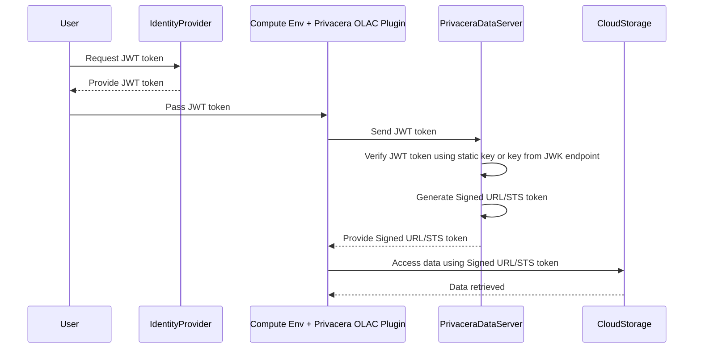
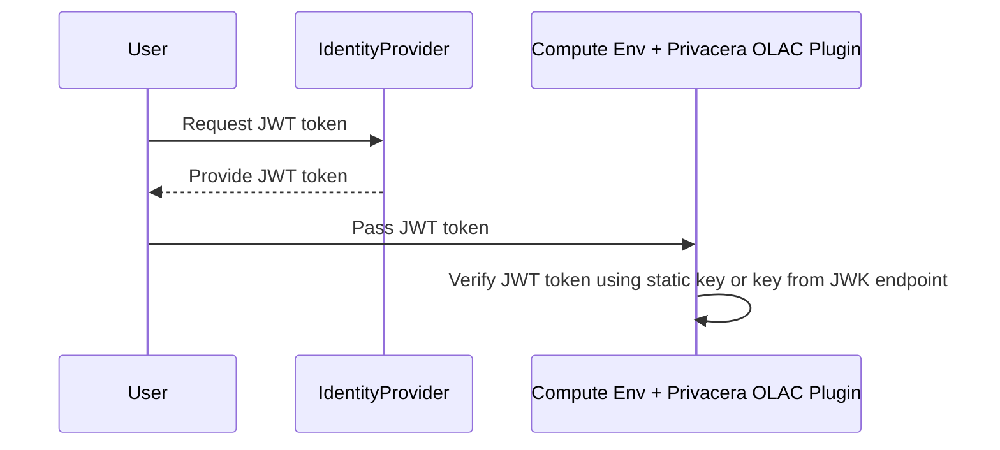

# JWT Tokens for user identity

## Overview

This feature allows the use of JWT tokens to carry the user identity information required by Privacera to enforce
access control. This works for certain connectors or use-cases where the data source may not be able to pass the user
identity reliably to Privacera.

### Connectors
The following connectors support the use of JWT tokens to carry user identity information:

- AWS EMR (on EC2) Spark OLAC connector without Kerberos
- AWS EMR-Serverless Spark OLAC connector without Lake Formation
- Databricks Standard Cluster OLAC connector
- Databricks High Concurrency Cluster FGAC connector
- Apache Spark on EKS OLAC connector

### Supported Deployments 
- PrivaceraCloud
- Self Managed Deployment
- PrivaceraCloud Data-plane Deployment

### Prerequisites

You need to have a JWT token generation capability in your identity provider (IdP) to generate the JWT token. 
The JWT token is signed by your IdP and contains the user identity information. The user is configured in Privacera with the same username. The public key of the IdP is used to validate the JWT token. It is either configured 
statically in Privacera or provided dynamially through a JWKS endpoint which is configured in Privacera.

For OLAC use-case, you need to have Privacera Dataserver configured and running, to which we will add
the additional configuration to validate JWT token.


### Sample Flow for OLAC



**Diagram Explanation**

1. **Request JWT Token**: The user requests a JWT token from the Identity Provider (IdP).
2. **Provide JWT Token**: The IdP provides the JWT token to the user.
3. **Pass JWT Token**: The user passes the JWT token to the compute environment.
4. **Send JWT Token**: The compute environment sends the JWT token to Privacera DataServer.
5. **Verify JWT Token**: Privacera DataServer verifies the JWT token signature by using either IdP public key that is
   statically configured or is obtained dynamically from IdP's JWKS endpoint.
7. **Generate Signed URL/STS Token**: Privacera DataServer generates a Signed URL or STS token.
8. **Provide Signed URL/STS Token**: Privacera DataServer provides the Signed URL or STS token to the compute
   environment.
9. **Access Data**: The compute environment accesses data from cloud storage using the Signed URL or STS token.
10. **Data Retrieved**: The data is retrieved from the cloud storage and provided to the compute environment.

### Sample Flow for FGAC



**Diagram Explanation**

1. **Request JWT Token**: The user requests a JWT token from the Identity Provider (IdP).
2. **Provide JWT Token**: The IdP provides the JWT token to the user.
3. **Pass JWT Token**: The user passes the JWT token to the compute environment.
4. **Send JWT Token**: The compute environment sends the JWT token to Privacera DataServer.
5. **Verify JWT Token**: Privacera DataServer verifies the JWT token signature by using either IdP public key that is
   statically configured or is obtained dynamically from IdP's JWKS endpoint.
7. **Generate Signed URL/STS Token**: Privacera DataServer generates a Signed URL or STS token.
8. **Provide Signed URL/STS Token**: Privacera DataServer provides the Signed URL or STS token to the compute
   environment.
9. **Access Data**: The compute environment accesses data from cloud storage using the Signed URL or STS token.
10. **Data Retrieved**: The data is retrieved from the cloud storage and provided to the compute environment.

## Concepts 

### JWT Token Format

A JSON Web Token (JWT) consists of three Base64 strings separated by dots (`.`). These 3 parts are
header, payload and signature. The header and payload are JSON objects, and the signature is a computed over
the header and payload using a secret key. The signature is used to confirm the identity of the issuer
and the integrity of the JWT token. 

The JWT token format is show with an example payload below. All the values are examples and should not be
used as is.

```json
{
  "iss": "https://testidp.example.com/issuer/websec",
  "sub": "infra_test_user",
  "iat": "1721223184",
  "exp": "1721283133",
  "aud": "https://dataserver.example.com"
}
```
The fields in the payload are as follows:

1. The `iss` field is the issuer of the JWT token. This value is configured in Privacera so that it can be used to obtain the configuration for validating the JWT token. This is a mandatory field. Typically, it is in the format of a URL, but it is a literal value and no connection attempt will be made to this URL.
1. The `sub` field is the subject of the JWT token. This is the user identity that Privacera should use to enforce access control. This is a mandatory field. You could configure another key in the payload to be used as the user identity.
1. The `iat` field is the issued at time of the JWT token. This is the time when the token was issued in Unix time. This is a mandatory field. The token is rejected if current time is before this time. 
1. The `exp` field is the expiration time of the JWT token. This is the expiry time of the token in Unix time. This is a mandatory field. The token is rejected if the current time is after this time.
1. The `aud` field is the audience of the JWT token. This is the intended recipient of the token, which is Privacera Dataserver. This is a string that is configured in Privacera and Privacera will use the token only if it matches. This is an optional field.

All other fields in the payload will be ignored by Privacera.

### JWT Signature Verification

JWT Signature verification is done using the public key of the IdP. The public key can be configured statically in Privacera or dynamically fetched from the IdP's JWKS endpoint.

Privacera supports only RSA256 and ECDSA256 algorithms for JWT token signature.

## Using JWT Token Feature

To use this feature you need to do the following:

1. OLAC
      2. Configure Privacera Dataserver to use JWT tokens
      3. Configure EMR, Databricks or Apache Spark plugin to use JWT token
      4. At runtime, generate JWT token and pass it to the Spark job
2. FGAC
      3. Configure the Databricks Spark plugin to use JWT token
      4. At runtime, generate JWT token and pass it to the Spark job 

## Using JWT Tokens

### OLAC

User will pass the JWT token string in a Spark configuration variable to the Spark job. Here is an example - 
```json
spark-sql \
--conf "spark.hadoop.privacera.jwt.token.str=<JWT_TOKEN>" \
--conf "spark.hadoop.privacera.jwt.oauth.enable=true"
```

### FGAC

User will copy the JWT token string to a file and pass the file path in a Spark configuration variable to the Spark job. Here is an example - 

```json
spark.hadoop.privacera.jwt.oauth.enable true
spark.hadoop.privacera.jwt.token /tmp/jwttoken.dat
spark.hadoop.privacera.jwt.0.token.parserType PING_IDENTITY
spark.hadoop.privacera.jwt.0.token.userKey client_id
spark.hadoop.privacera.jwt.0.token.issuer https://privacera.com/issuer/websec
spark.hadoop.privacera.jwt.0.token.publickey /tmp/jwttoken.pub
```

You can copy the JWT token file to Spark cluster using the following steps:
```python
file_path="/tmp/ptoken.dat"
token="<jwt_token>"
file1 = open(file_path,"w")
file1.write(token)
file1.close()
```
[TODO: Add steps on how to copy the JWT token file to all nodes of a Databricks cluster]
[TODO: Add steps on how to copy the JWT token file to all nodes of a EMR cluster]

## Configuring Privacera

### OLAC

You need to configure the Privacera Dataserver to use JWT tokens for OLAC. The configuration maps 
the issuer value to a set of configurations that are used to validate the JWT token. As such multiple
issuer configurations can be added to Privacera Dataserver.


### FGAC


