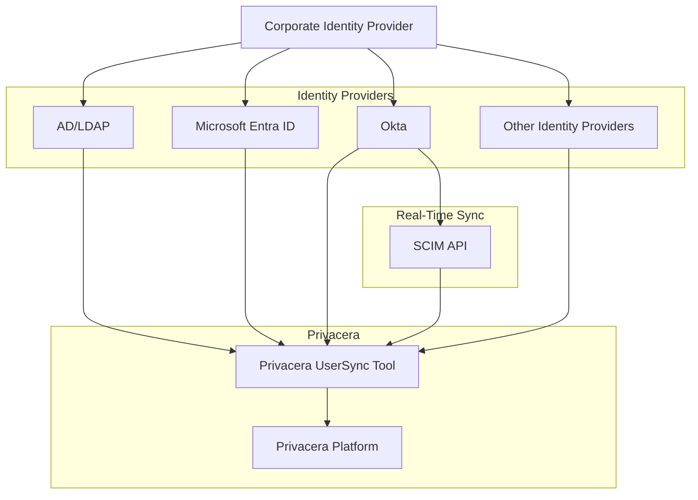
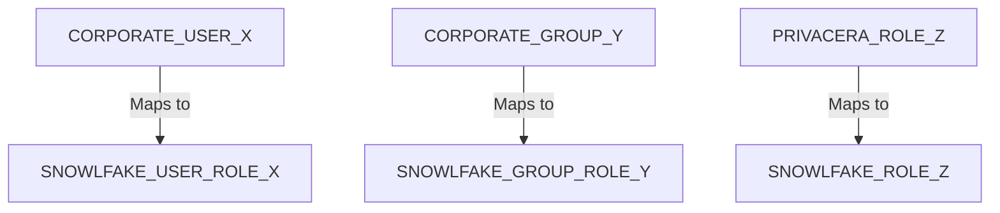
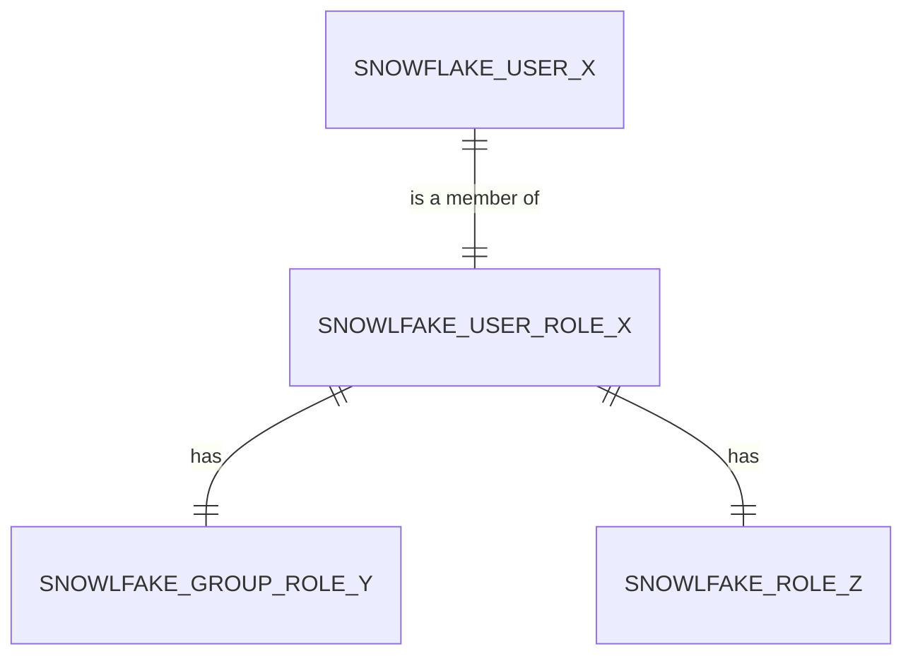
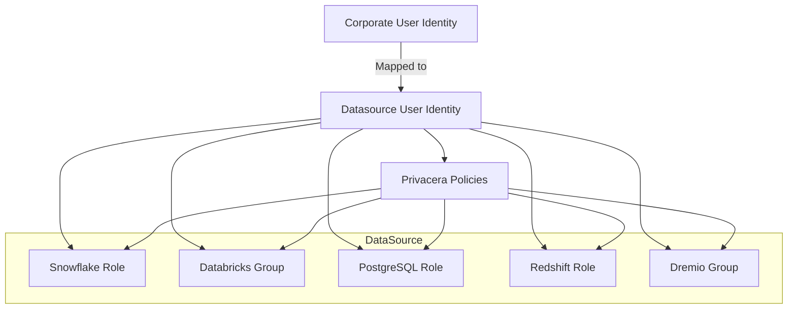

# User Identities and Access Management

There are two sets of user identities:

1. **Corporate User Identity**: This set comes from the corporate identity provider, which could be AD/LDAP, Microsoft Entra ID, Okta, or any other identity provider. These user identities are synchronized with Privacera, and policies can be created based on them. Generally, usernames are mapped to users in Privacera, and groups are mapped to groups in Privacera.

2. **Datasource User Identity**: This set of user identities is specific to the data source. Examples include email addresses in Databricks or IAM Roles in AWS. In Snowflake, policies are set for the Snowflake Database Roles. Privacera maps Corporate User Identities to Datasource User Identities. For instance, a user in AD/LDAP is mapped to an email address in Databricks. Since every data source has its own set of user identities, refer to each connector section for the respective mappings.

## Privacera Roles

Privacera Roles, also known as Apache Ranger Roles, are created and managed within Privacera. These roles are flexible, support nested roles, and contain users and groups. When roles are created in Privacera, they are mapped to equivalent constructs in the data source. For example:

- **Snowflake**: Mapped to Snowflake Database Roles.
- **Databricks**: Mapped to Databricks Groups.
- **AWS**: Mapped to IAM Roles.

In most cases, Privacera will create the corresponding mapping roles or groups in the data source.

## Privacera UserSync Tool

Privacera UserSync is a tool that synchronizes user identities from the corporate identity provider to Privacera. It
supports multiple identity providers, including AD/LDAP, Microsoft Entra ID, Okta, and more. UserSync can be scheduled
to run at regular intervals to keep user identities in sync with the corporate identity provider. For identity providers
that support SCIM, Privacera can use SCIM APIs to synchronize user identities, enabling real-time updates. For example,
in Okta, Privacera's app is registered in Okta, and the SCIM API is used to synchronize user identities.

This diagram illustrates how the Privacera UserSync tool interacts with various corporate identity providers,
synchronizes user identities, and integrates with the Privacera platform. The real-time synchronization through SCIM API
is highlighted for identity providers that support this feature, such as Okta.

## User Identity Mapping

Since each data source has its own set of user identities, Privacera maps Corporate User Identities to Datasource User
Identities based on what is available on the data source side. For example, a user in AD/LDAP is mapped to an email
address in Databricks. In Snowflake, a Snowflake role is created for each user, and user-level policies are mapped to
the corresponding Snowflake role, while groups and roles in Privacera are mapped to roles in Snowflake.

**Below is an example of how user identities are mapped in Snowflake:**

- **Corporate User Identity**: User in AD/LDAP
- **Datasource User Identity**: Snowflake role
- **Mapping**: User policies in Privacera are mapped to the corresponding Snowflake role. Users, Groups and roles in
  Privacera are mapped to Snowflake roles.

**Below is the hierarchy of user identities in Snowflake:**

## Managing User Identities and Roles in Data Sources

Privacera automatically manages the relationships within the users and groups/roles in the data source, eliminating the
need for manual management. For example:

- **Snowflake**: Privacera creates Snowflake roles and manages the relationships between users and roles.
- **Databricks**: Privacera creates Databricks groups and manages the relationships between users and groups.
- **Other Data Sources**: This includes PostgreSQL, Redshift, Dremio, and more, where Privacera handles user and group
  relationships similarly.

Managing user identities might require additional privileges in the data source. For example, managing groups in
Databricks Unity Catalog requires SCIM API access.

**Managing user identities is optional**. If not managed by Privacera, ensure that user identities are created in the
data source so Privacera can assign the necessary privileges. Privacera regularly monitors user identities and roles in
the data source. If new users or groups are added, Privacera will automatically assign privileges to them based on the
policies defined in Privacera. This reconciliation process is performed periodically, and its frequency can be
configured in Privacera.

**Example Diagram**

