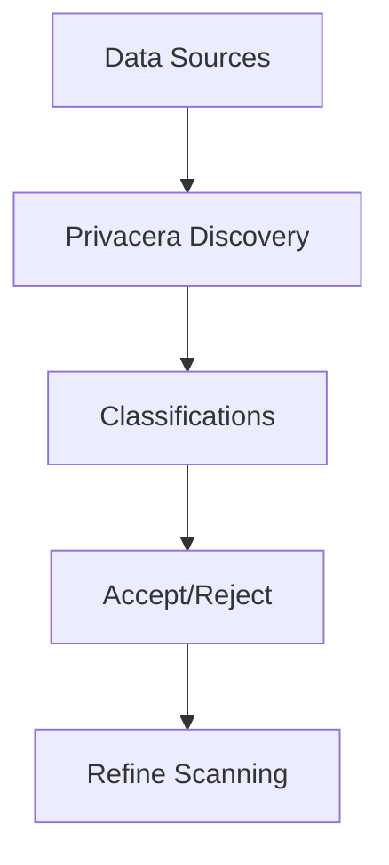

# Overview of Privacera Discovery

## Overview

Privacera Discovery crawls through various data assets such as databases or files, collectively referred to as _data sources_. It scans these sources to identify sensitive information like credit card numbers, Social Security Numbers, and other personal, restricted, or confidential information.

Privacera Discovery classifies or labels this information to create a comprehensive catalog of your sensitive data. You can review these classifications to accept or reject them or refine the scanning using rules, dictionaries, models, and patterns.

-   :material-page-previous: Prev topic: [Introduction](index.md)
-   :material-page-next: Next topic: [Key Features and Benefits](features.md)

