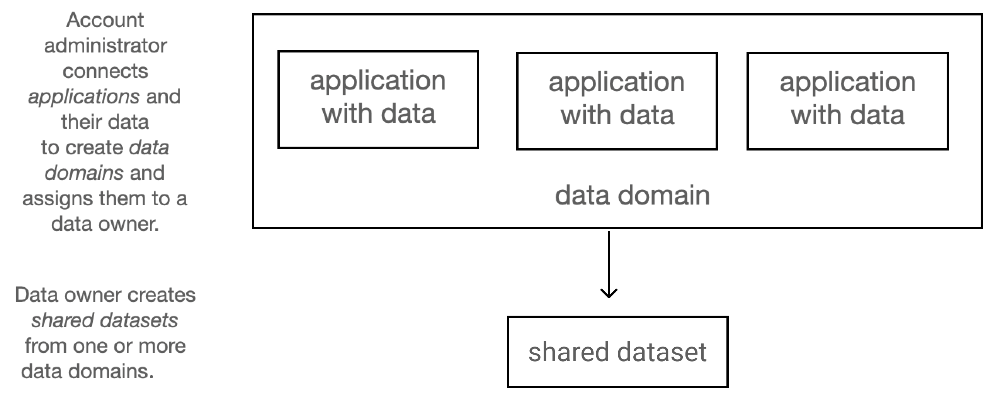
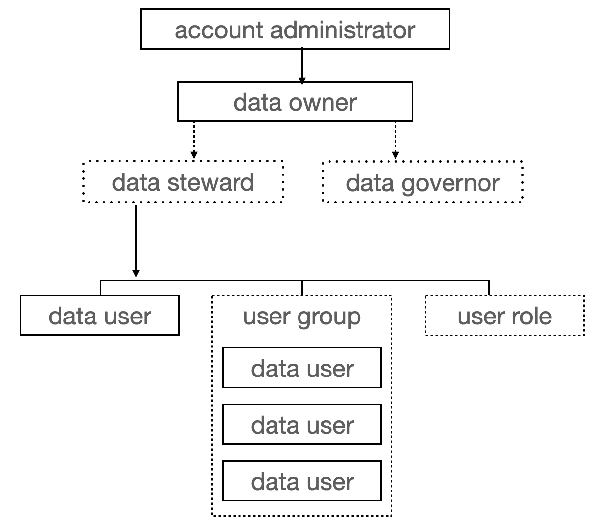

# Governed Data Stewardship (GDS) Concepts

The high-level relationship among applications with data and the people
involved in PrivaceraCloud Governed Data Stewardship is described in this
section.

## Data relationships

These diagrams present two different views of the relationships of data in
Privacera Governed Data Stewardship.

Dotted lines in these diagrams indicate features that are optional.

The following diagram represents how the data in Governed Data Stewardship is
mechanically created by the various roles.

### Application with data resources

An application defines a third-party system that contains the data analyzed by
PrivaceraCloud. The account administrator connects applications to
PrivaceraCloud to make their data accessible. Depending on the type of
application, it can contain resources or databases or tables.

The following data sources are supported by GDS

* ADLS
* Athena
* Aurora DB
* Databricks
* Databricks SQL
* Databricks Unity Catalog
* Dataproc
* Dremio
* Dynamo DB
* EMR
* Files
* GCS
* Glue
* Microsoft SQL
* PostgreSQL
* Presto
* Redshift
* S3
* Snowflake
* Starburst Enterprise
* Trino

_Resources_ is a generic term for the data made available to PrivaceraCloud by
connecting an application. For example, files in an application, such as .csv
or .json files in an S3 bucket, are resources.

A _database_ is a single collection of data in an application, and a _table_
is a subset of a database with a distinct schema.

### Data domain and shared dataset

A _data domain_ is a defined combination of applications with data that can be
operated on as a whole for the purpose of access control or Privacera
Discovery scans.

* A data domain is a logical abstraction, whereas an application with data represents a physical third-party system that has been connected to PrivaceraCloud by the account administrator.

* A data domain can include multiple applications with data of different types.

* The account administrator constructs a data domain and assigns the data owner of the domain.

* A _shared dataset_ is composed of one or more data domains that the data owner or data steward shares with data users.

### Data invisibility until access granted

PrivaceraCloud users cannot see datasets or domains unless you specifically
grant them access by assigning one of Governed Data Stewardship's roles to
specific datasets or domains.

Likewise, if you have assigned a role to a user, such as a data owner
assigning a data steward, but later unassign that role, that user can no
longer see your data.

## Flexible data governance roles to meet your needs

Governed Data Stewardship's defined roles might not exactly match the names of
your organization's hierarchy of work functions for data governance. For
instance, you might have a different term for "data owner" or "data steward"
or "data user".

For simplicity, Governed Data Stewardship abstracts various work functions
into generalized roles. Governed Data Stewardship gives you the flexibility to
associate these roles with your own job functions.

You decide how you want to map your organization's exact definition of
functional roles to Governed Data Stewardship’s general terms.

For example, you might have many different organization roles for the people
who actually work with your data. You might have data analysts, ETL
programmers, or data scientists. Governed Data Stewardship relies on the term
data user to cover these functions.

Examine these predefined roles in Governed Data Stewardship and map their
capabilities to your own organizational titles. You can then assign these
various roles to the appropriate users.

### Hierarchy of roles

This diagram shows the logical hierarchy of relationships among the roles
involved in Governed Data Stewardship.

Dotted lines in this diagram indicate features that are optional.

Figure 1. Hierarchy of Roles for GDS

!!! info "Roles in Governed Data Stewardship"

    Any PrivaceraCloud user can be given any of these roles.

#### Account administrator

The account administrator is the first person who created an account for your
organization on PrivaceraCloud.

The account administrator:

* Creates users and groups.

* Connects applications with data.

* Defines data domains based on applications.

* Assigns data domains to data owners.

* Can run Privacera Discovery scans on data domains.

#### Data owner and data steward

A data owner is a PrivaceraCloud user who has been assigned the data owner
role by the account administrator for a particular data domain.

An optional data steward is a PrivaceraCloud user who has been assigned as a
delegate by the data owner of a particular data domain.

There is no limit to the number of data owners or data stewards of a data
domain.

A data owner or data steward:

* Creates and shares datasets composed of data domains.

* Can optionally delegate most of these functions to data stewards.

* Gives access to datasets to users, groups, or roles.

* Can make shared datasets discoverable by data users.

* Accepts or rejects requests from data users to access shared datasets.

* Grants read/write access permissions to users, groups, or roles in datasets, resources in those datasets.

* A data owner can run Privacera Discovery scans on data domains and shared datasets.

!!! info "Privileges of a data steward"

    Except for running Privacera Discovery scans, a data steward has all the same functions of a data owner.

#### Data governor

A data governor is a PrivaceraCloud user who has been assigned this role by
the data owner. Data governors have the function of an auditor.

A data governor:

* Can see all data in data domains, shared datasets, resources, and discovery scan results to which they have been given access.

* Cannot change the data in any of those data domains, shared datasets or resources.

* Can initiate discovery scans.

* Can cancel discovery scans started by other users for data to which the data governor has access.

#### Data user

A data user is a PrivaceraCloud user who has been assigned certain Privacera
system roles by the account administrator. A data user is given access to data
domains or shared datasets with certain permissions by a data owner or data
steward.

_Data user_ is a general term for many different work functions that your
organization might have. For example, you might have data analysts, ETL
programmers, data scientists, and auditors.

For simplicity, Governed Data Stewardship abstracts these various functions
into a single role: data user. Your organization's definition of these various
possible functional roles is for you to decide.

A data user:

* Can request access to shared datasets that have been made discoverable by data owners or stewards.

* Can access shared datasets that they have been given permission to see.

* Concepts in Governed Data Stewardship
* Data relationships
    * Application with data resources
    * Data domain and shared dataset
    * Data invisibility until access granted
* Flexible data governance roles to meet your needs
    * Hierarchy of roles
